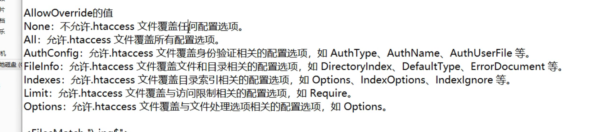
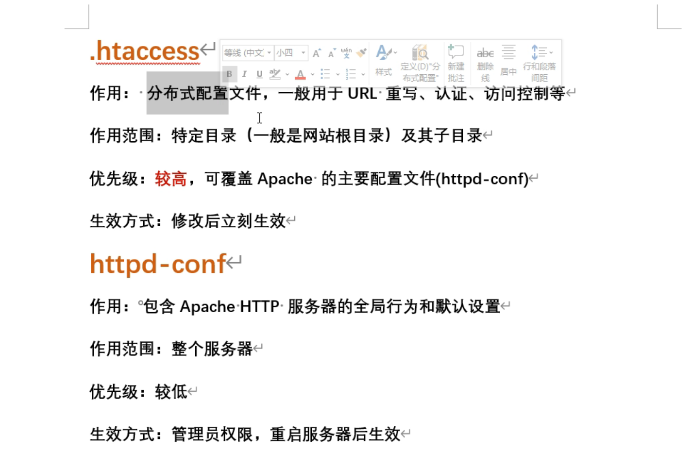
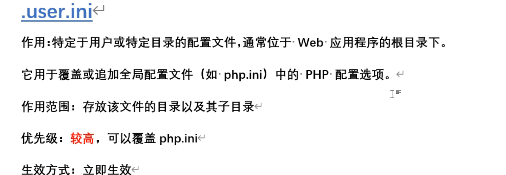
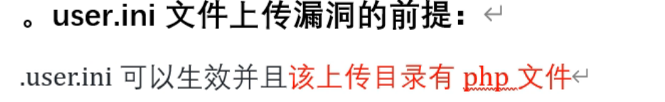
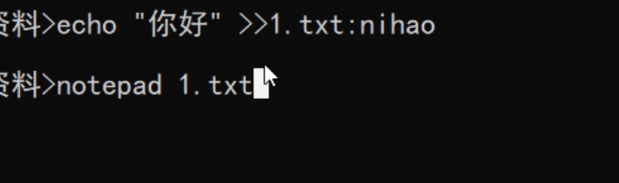
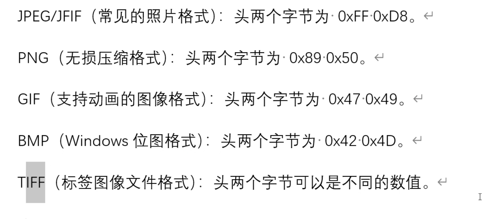
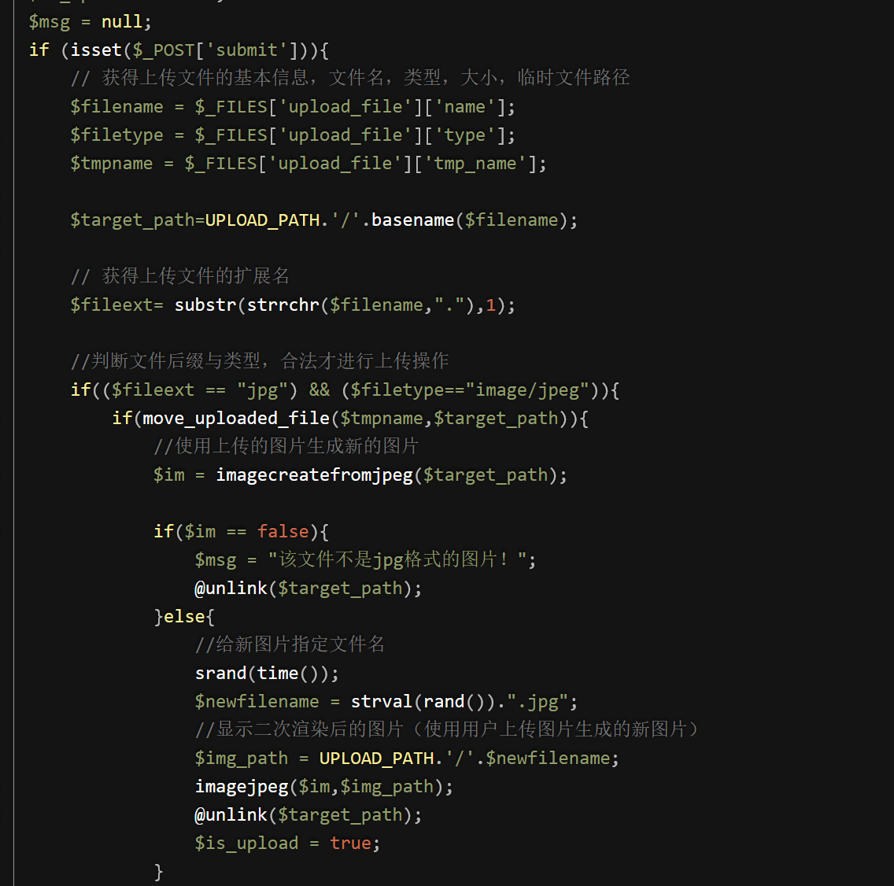

# upload学习知识点

upload学习过程中涉及的知识点

## 一、配置文件

对配置文件的修改

upload相关配置文件

.htaccess文件的优先级高所以其危险性更大

user.ini文件生效前提是目录中存在php文件可以对其进行覆盖

## 二、额外数据流

在Windows操作系统中，当你看到文件名后跟着"::D A T A " 时，它表示文件的一个附加数据流 ( A l t e r n a t e D a t a S t r e a m ， A D S ) 。数据流是 − − 种用于在文件内部存储额外数据的机制在普通情况下，我们使用的文件只有一个默认的数据流，可以通过文件名访问。但是 W i n d o w s N T 文件系统 ( N T F S ) 支持在文件内部创建额外的数据流，以存储其他信息。这些额外的数据流可以通过在文件名后面添加 " … DATA"时，它表示文件的一个附加数据流(Alternate DataStream，ADS)。数据流是--种用于在文件内部存储额外数据的机制 在普通情况下，我们使用的文件只有一个默认的数据流，可以通过文件名访问。但是Windows NT文件系统(NTFS)支持在文件内部创建额外的数据流，以存储其他信息。这些额外的数据流可以通过在文件名后面添加"…DATA"时，它表示文件的一个附加数据流(AlternateDataStream，ADS)。数据流是−−种用于在文件内部存储额外数据的机制在普通情况下，我们使用的文件只有一个默认的数据流，可以通过文件名访问。但是WindowsNT文件系统(NTFS)支持在文件内部创建额外的数据流，以存储其他信息。这些额外的数据流可以通过在文件名后面添加"…DATA"来访问
原理:Windows系统下，如果上传的文件名中test.php::$DATA会在服务器上生成-个test.php的文件，其中内容和所上传文件内容相同，并被解。
 

要访问额外数据流信息即可noteoad 文件名称 ： 设置的数据流空间名称

php不会验证文件数据流故可以上传成功

在windows中不允许文件名后缀带有：：$故上传后php后的标识会消失

## 三.空格绕过

windows系统中.空格会被自动删除所以可以用来绕过

所以在上传木马的时候可以将php文件后缀加入.空格.空格来绕过

## 四、空字符

0x00与%00都表示空

## 五、图片字节表示

## 六、相关php函数

getimagesize() 函数获取图像文件的信息，返回一个包含多个元素的数组。这个数组包括图像的宽度、高度、MIME 类型等信息。
如果 $filename 不是图像文件，getimagesize() 会返回 false。

exif_imagetype() 读取一个图像的第一个字节并检查其签名。如果发现了恰当的签名则返回一个对应的常量，否则返回 FALSE。返回值和 getimagesize() 返回的数组中的索引 2 的值是一样的，但本函数快得多。

那么它的语法是：

exif_imagetype ( string $filename ) : int

$filename是文件位置和名称，如果检查是图片文件则返回一个跟图像类型对应的数字，否则返回 FALSE。

image_type_to_extension($info[2]) 会根据 getimagesize() 返回的图像信息中的 MIME 类型（即 $info[2]）返回对应的扩展名。例如，image_type_to_extension() 会把 IMAGETYPE_JPEG 转换为 .jpeg，IMAGETYPE_PNG 转换为 .png，等等。
检查文件扩展名是否在允许的图像类型中：

pathinfo()该函数用于获取其后缀名称**文件扩展名获取**：可以通过 `pathinfo()` 提取文件的扩展名，方便做文件类型检查

$ext = pathinfo($filename, PATHINFO_EXTENSION);

## 七、二次渲染

二次渲染会对文件进行一次重写其显示的内容不变但是文件本身内容发送一部分的改变

## 八、条件竞争

upload-labs18关的源码

$is_upload = false;  
$msg = null;   
if(isset($_POST['submit'])){  // 检查是否提交了上传表单，如果提交了则执行下面的代码块  
    $ext_arr = array('jpg','png','gif');  // 定义允许上传的文件类型数组，包括jpg，png，gif  
    $file_name = $_FILES['upload_file']['name'];    // 从上传表单中获取上传文件的名字  
    $temp_file = $_FILES['upload_file']['tmp_name'];    // 从上传表单中获取上传文件的临时路径  
    $file_ext = substr($file_name,strrpos($file_name,".")+1);  // 获取上传文件的扩展名，即文件名的最后部分
    $upload_file = UPLOAD_PATH . '/' . $file_name;  // 拼接出上传文件的完整路径，创建以原文件名为名的文件    
    if(move_uploaded_file($temp_file, $upload_file)){  // 将临时文件移动到指定的路径，如果移动成功则执行
        if(in_array($file_ext,$ext_arr)){  // 检查上传文件的扩展名是否在允许的类型数组中，如果在则执行下面的代码块
            $img_path = UPLOAD_PATH . '/'. rand(10, 99).date("YmdHis").".".$file_ext; 
            #生成新的文件名，包括随机数字、当前日期和时间以及原文件的扩展名  
            rename($upload_file, $img_path);   // 将上传的文件重命名为新的文件名  
            $is_upload = true;  
        }else{  // 如果上传文件的扩展名不在允许的类型数组中，则设置错误消息，并删除上传的文件  
            $msg = "只允许上传.jpg|.png|.gif类型文件！";  
            unlink($upload_file);  
        }   
    }else{  
        $msg = '上传出错！';  
    }  
}

将文件上传到服务器，然后通过rename修改名称，再通过unlink删除文件，因此可通过条件竞争的方式在unlink之前，访问webshell。

使用burp拦截上传18.php的数据包并对数据包发送至intruder模块进行高速重发（上传包）

其实就是利用代码执行的逻辑问题来进行上传，如：当文件先上传后改名时就可以通过不断的发包从而访问到指定的文件

条件竞争解释：

## 九、系统解析漏洞

系统解析文件是从后往前解析，如1.php.7z先解析7z后解析php，故阿帕奇系统存在此文件上传漏洞

